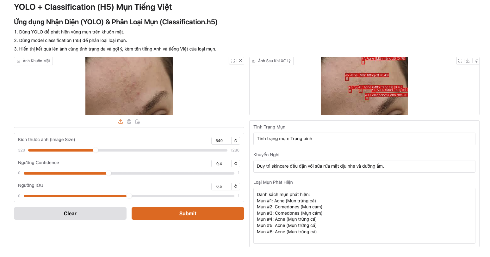

# Dự Án Nhận Diện & Phân Loại Mụn

## Giới Thiệu

**Dự án Nhận Diện & Phân Loại Mụn** sử dụng mô hình YOLOv8 kết hợp với mô hình phân loại đã được huấn luyện để phát hiện và phân loại các loại mụn trên khuôn mặt từ hình ảnh. Người dùng có thể tải lên hình ảnh từ máy tính hoặc sử dụng webcam để chụp hình trực tiếp. Hệ thống sẽ tự động phát hiện các vùng mụn, phân loại loại mụn và hiển thị kết quả chi tiết cùng với đánh giá tình trạng da và khuyến nghị chăm sóc.

## Demo



[Demo Huggingface](https://huggingface.co/spaces/ducdatit2002/acne-detection-classification).

## Tính Năng

- **Phát hiện mụn**: Sử dụng YOLOv8 để xác định vị trí các vùng mụn trên khuôn mặt.
- **Phân loại mụn**: 
+ Version 1: Sử dụng mô hình phân loại (classification.h5) để xác định loại mụn cụ thể như Mụn trứng cá, Mụn cám, Mụn sẩn, và Mụn mủ.
+ Version 2: Sử dụng mô hình ResNet18 đã được huấn luyện để phân loại từng vùng mụn thành 12 loại khác nhau bao gồm: acne_scars, blackhead, cystic, flat_wart, folliculitis, keloid, milium, papular, purulent, sebo-crystan-conglo, syringoma, whitehead (Loss: 0.3535, Val Loss: 1.1175, Val Acc: 0.6298)
+ Version 3: Sử dụng mô hình DenseNet121 đã được huấn luyện để phân loại từng vùng mụn thành 12 loại khác nhau bao gồm: acne_scars, blackhead, cystic, flat_wart, folliculitis, keloid, milium, papular, purulent, sebo-crystan-conglo, syringoma, whitehead (Final Val Loss: 1.1653, Val Acc: 0.7702, Val F1: 0.774)

- **Giao diện thân thiện**: Tải lên hình ảnh hoặc sử dụng webcam để chụp hình trực tiếp.
- **Hiển thị kết quả chi tiết**: Hiển thị hình ảnh đã được đánh dấu mụn kèm theo bảng kết quả chi tiết về loại mụn, độ tin cậy và đánh giá tình trạng da.
- **Khuyến nghị chăm sóc**: Cung cấp các khuyến nghị chăm sóc da dựa trên số lượng và loại mụn được phát hiện.

## Công Nghệ Sử Dụng

- **Python 3.11**
- **Gradio**: Để xây dựng giao diện người dùng trực quan.
- **YOLOv8 (Ultralytics)**: Để phát hiện các vùng mụn trên khuôn mặt.
- **TensorFlow & Keras**: Để xây dựng và sử dụng mô hình phân loại mụn.
- **Pillow**: Để xử lý và vẽ hình ảnh.
- **UltralyticsPlus**: Thư viện hỗ trợ cho YOLOv8.

## Cài Đặt

### Bước 1: Cài Đặt Conda và Tạo Môi Trường

Nếu bạn chưa cài đặt Anaconda hoặc Miniconda, hãy tải và cài đặt từ [trang chính thức của Conda](https://docs.conda.io/en/latest/miniconda.html).

Tạo môi trường ảo với Python 3.11:

```bash
conda create -n acne_detection_env python=3.11
conda activate acne_detection_env
```

### Bước 2: Cài Đặt Các Yêu Cầu

Chuyển đến thư mục dự án và cài đặt các thư viện cần thiết bằng `pip`:

```bash
pip install -r requirements.txt
```

**Lưu ý:** Đảm bảo bạn đã có file `best.pt` (mô hình YOLOv8) và `classification.h5` (mô hình phân loại) trong thư mục làm việc để hệ thống hoạt động đúng.

## Chạy Ứng Dụng

Khởi chạy ứng dụng Gradio:

```bash
python app.py
```

Sau khi chạy lệnh trên, ứng dụng sẽ mở ra trong trình duyệt của bạn hoặc cung cấp một liên kết để truy cập ứng dụng trực tuyến.

## Cấu Trúc Thư Mục

```
acne-detection-classification/
├── app.py
├── best.pt
├── classification.h5
├── requirements.txt
├── README.md
├── .gitignore
└── .gradio/
```

- **app.py**: Tệp chính chạy ứng dụng Gradio.
- **best.pt**: Mô hình YOLOv8 đã được huấn luyện để phát hiện mụn.
- **classification.h5**: Mô hình phân loại mụn đã được huấn luyện.
- **requirements.txt**: Danh sách các thư viện Python cần thiết.
- **README.md**: Tệp hướng dẫn này.
- **.gitignore**: Tệp cấu hình để bỏ qua các thư mục và tệp không cần thiết trong Git.
- **images/**: Chứa các hình ảnh minh họa cho README.
- **.gradio/**: Thư mục tạm thời của Gradio (được bỏ qua trong Git).

## Sử Dụng

1. **Chọn phương thức nhập hình ảnh**: Tải lên từ máy tính hoặc chụp hình bằng camera.
2. **Tải lên hoặc chụp hình**: Sử dụng tùy chọn đã chọn để cung cấp hình ảnh.
3. **Phát hiện và phân loại mụn**: Hệ thống sẽ tự động phát hiện và phân loại các loại mụn trên hình ảnh.
4. **Xem kết quả**: Xem hình ảnh đã được đánh dấu các vùng mụn kèm theo bảng kết quả chi tiết về loại mụn, độ tin cậy và đánh giá tình trạng da.


## Liên Hệ

Nếu bạn có bất kỳ câu hỏi hoặc đề xuất nào, vui lòng liên hệ với tôi qua email: **ducdatit2002@gmail.com** hoặc [GitHub](https://github.com/ducdatit2002/acne-detection-classification).

---
